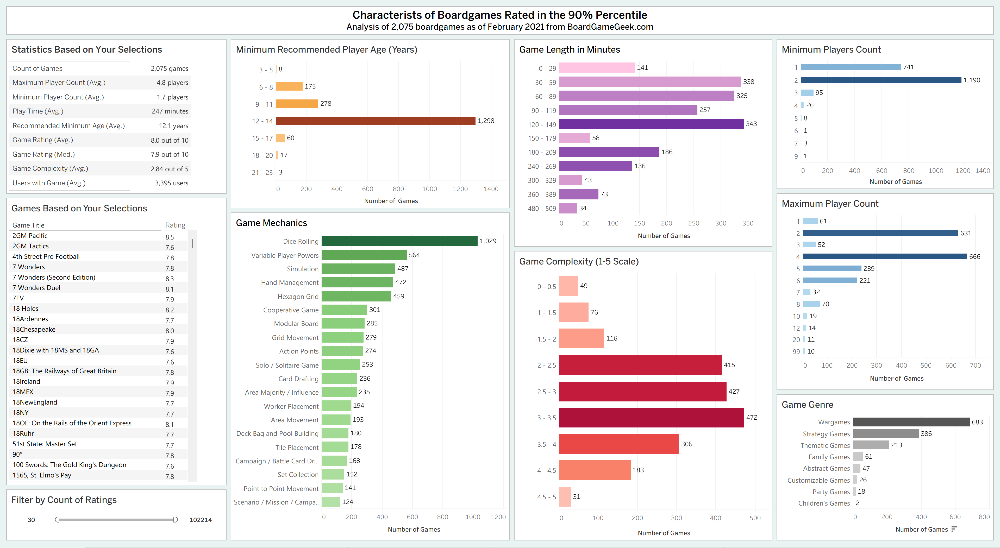

# BoardGameGeek.com Excel and Tableau Project

## Tableau Dashboard

<p align="center">
  <a href="https://public.tableau.com/shared/G2Z5PH787?:display_count=n&:origin=viz_share_link">
    
  </a>
  <br>
  <a href="https://public.tableau.com/shared/G2Z5PH787?:display_count=n&:origin=viz_share_link">View the Tableau dashboard</a>
</p>

---

## Introduction

My name is David Honig and I'm a Data Analyst. I'm also a fan of boardgames with some favorites including Ascension, San Juan, and Century Golem Edition. This project demonstrates a variety of Excel skills needed as an analyst

## Background

[According to an article by Fortune Business Insights](https://www.fortunebusinessinsights.com/board-games-market-104972), "The global board games market size was valued at USD 14.37 billion in 2024. The market is projected to grow from USD 15.83 billion in 2025 to USD 32.00 billion by 2032.

North America dominated the board games market with a market share of 41.68% in 2024.
	
## Scenario

I'm a data analyst working for a fictional boardgame developer called *Checkmate LLC*. Ms. Queen, the company president, is looking to make the next best selling game. Checkmate has a team of developers but doesn't know what they should concentrate on.
	
Mr. Rook of the marketing team has previously found the highest rated games sell the most and bring in the  most revenue. 

My manager, Mr. Bishop, has assigned me the task of looking for commonalities in the top boardgames which could help point the development team in the right direction.

### Excel Skills Used

The following Excel skills were utilized for analysis:

- **📊 Pivot Tables**
- **📈 Pivot Charts**
- **🧮 DAX (Data Analysis Expressions)**
- **🔍 Power Query**
- **💪 Power Pivot**
 
## Data collection

BoardGameGeek.com is a well-known website in the board game community. It provides many details for each game, allows users to rate games, and keeps track of games in each user's collection.
	
[A dataset from February 2021](https://www.kaggle.com/datasets/melissamonfared/board-games) was located from [kaggle.com](www.kaggle.com).
- The Comma Separated Values (.csv) file was partially cleaned by excluding unranked games and including games with a minimum of 30 user ratings.
	
## Dataset Review
1. 20,345 rows were imported into an Excel Table named "All_Games".
1. Unique ID will be used as a primary key.
1. The formula `=COUNTBLANK(All_Games[ID])` found 15 missing IDs.

### Updating missing IDs

1. Missing IDs could be found by quickly searching boardgamegeek.com, but an approach was taken if there were many more missing values.
1. [A BoardGameGeek list from February 2025](https://www.kaggle.com/datasets/bwandowando/boardgamegeek-board-games-reviews-jan-2025) was loaded with "Only create Connection" and named *Feb2025 Boardgames*. This dataset was not originally used as it is missing many game details.
1. The two queries were merged, a "Conditional Column" was added, and after removing duplicates the column ID was finalized.  

<p align="center">
	
</p>
	
## When did we get so popular?

1. The table All_Games was added to the Data Model and a count of all games was calculated: `Game_Count:=DISTINCTCOUNT(All_games[ID])`
1. Median of the Game Rating was calculated: `All_Games_Median:=MEDIAN(All_games[Game Rating])`
1. Looking at the pivotchart **"How Many Boardgames Have Been Created Over Time?"**, over the past 20 years the number of boardgames have greatly increased.   

<p align="center">
	
</p>
	
The histogram **"How Are All the Boardgames Rated"** uses the "Game Rating" column creating a nice bell curve. Using the formula `All_Games_Median:=MEDIAN(All_games[Game Rating])`, the median value is 6.43 out of 10.

<p align="center">

</p>

## Do you have a game recommendation?

- The 90th and 95th percentile were calculated: `90th_Percentile:=PERCENTILE.INC(All_games[Game Rating],0.90)` (changing the final element for 95th percentile)
- Two more measure were created to count the number of games in these percentiles.
```
 Count_of_90th_Percentile:=VAR PercentileValue = [90th_Percentile]
			RETURN
			COUNTROWS(
			 FILTER(
			 All_games,
			 All_games[Game Rating] >= PercentileValue))
```
- The 90th percentile was chosen with 2,075 games with a Game Rating of 7.56 or higher compared to the 95th percentile with 1,038 games and a Game Rating of 7.88 or higher.
			
- A new query named "Top_Games" was referenced and games were filtered by on the Game Ratings column to those greater than or equal to 7.56.
- Column statistics were checked to make sure there were 2,075 rows and the query was added to the data model.

# Let's be explicit

Explicit measures were added including:
1. The count of games: `Count_TopGames:=DISTINCTCOUNT(TopGames[ID])`
1. Percent of the top games:
     ```
     Percent_of_games:=DIVIDE(
       COUNT(TopGames[ID]),
       CALCULATE(COUNT(TopGames[ID]), ALL(TopGames)))
    ```
1. Game Rating: `Game_Rating_TopGames:=AVERAGE(TopGames[Game Rating])`
1. Complexity: `Complexity_TopGames:=AVERAGE(TopGames[Complexity])`

## How many can play?

The sheet "# of Players" compares the minimum and maximum number of players to the Game Rating.
1. A handful of games listed their minimum or maximum players counts as 0. As this is unlikely, they were updated to null.
1. The most common minimum number of player for the top games is 2 at 1,190 games and 1 at 741 games.  

<p align="center">	
	
</p>	  
	
1. The most common maximum number of player for the top games is 4 at 666 games and 2 at 631 games.  

<p align="center">
	
</p>    
	
1. Based on the chart, people prefer when fewer players are needed to start the game.

### Going on a side quest

Top_Games was referenced to create "Top_Games_Minimum_Players" with a filter applied to Min Players for any values >=5.
- In the Top Games, only 13 require more than 4 players
- Changing the filer again, only 39 games require more than 3 players.

## One more round?

"Play Time" includes a chart with the top 20 play times.
- The most common playtimes are in increments of 30 minutes. To address less common intervals, the "Time Buckets" column sorts the games into 30 minute increments with formula:
`Number.ToText(Number.RoundDown([Play Time] / 30) * 30) & " - " & Number.ToText(Number.RoundDown([Play Time] / 30) * 30 + 29)`
- 2 to 2.5 hours, 30 minutes to 1 hour, and 1 hour to 1.5 hours are the most popular followed by 1.5 hours  to 2 hours following close behind.
- Between 1 and 2 hours is the ideal play time. It's long enough to have engaging gameplay and strategy, yet short enough to prevent the game from becoming tedious. 

<p align="center"> 

</p> 
		
## More complicated than Trouble

The "Minimum Age" sheet includes the chart "What is the Minimum Player Age of the Top Games?"
- 236 games have a minimim age of 0, with the next lowest age of 4 years. Based on previous columns these 0 values should have been null and were updated in Power Query.
- Designing and themeing for a specific ages is unlikely, so age buckets of 3 years were created with the formula:
`Number.ToText(Number.RoundDown([Min Age] / 3) * 3) & " - " & Number.ToText(Number.RoundDown([Min Age] / 3) * 3 + 2)`
- Over 60% of the top games are recommend players be at least 12 to 14 years old.
- At this age they would be mature enough to understand the rules and come up with a strategy.

<p align="center">

</p>

## Do you  have any Jacks?

While there are over 20,000 boardgames with a myriad of designs and themes, there are similar ways the games are played.
Boardgame mechanics are the specific rules and systems that define how a game is played, influencing player actions, outcomes, and the overall flow of the game. They dictate everything from turn order to how players achieve victory. Each game typically has multiple mechanics.
	
The "Top_Games" query was referenced creating a new query named "Top_Games_Mechanics".
1. Cleaning up the data, 27 games have no mechanic listed. Blank cells were replaced with "None Listed."
1. Each mechanic was split into 17 new columns which were then unpivoted.
1. Data was saved to a PivotTable Report and the query was added to the data model.
1. Explicit measures were created to:
     1. Count the number of mechanics
       `Count_Top_Game_Mechanics:=COUNT(Top_Games_Mechanics[Top_Game_Mechanics])`
     1. Count the number of distinct mechanics
       `Distinct_Top_Game_Mechanics:=DISTINCTCOUNT(Top_Games_Mechanics[Top_Game_Mechanics])`
     1. Calculate the percentage of the mechanic to all mechanics:
	 
       ```
       Percent_of_Mechanic_to_all_mechanics:=DIVIDE(
	      COUNT([Top_Game_Mechanics]),
	      CALCULATE(COUNT(Top_Games_Mechanics[Top_Game_Mechanics]), ALL(Top_Games_Mechanics)))
       ```
	 
     iv. Calculate the percentage of the top games with the mechanic.
       
	   ```
       Percent_of_mechanic_to_all_games:=DIVIDE(
          COUNT([Top_Game_Mechanics]),
          CALCULATE(COUNT(TopGames[ID]), ALL(TopGames)))
       ```

1. The sheet "Game Mechanics" was created with a Pivot Table from the Data Model.
- Board game players seem to like the excitement and uncertainty of rolling their math rocks (dice) with 1,029 of the top games using the "Dice Rolling" mechanic.
- This is followed by Variable Player Powers, Simulation, Hand Management, and a Hexagon Grid used in ~500 of the top games.  

<p align="center">

</p>

## Wait, what am I supposed to do next?

For each game, Boardgamegeek assigns a complexity rating between 1 and 5 defined as a "Community rating for how difficult a game is to understand. Lower rating (lighter weight) means easier."

1. A new column "Complexity Rounded" was created: `Number.RoundDown([Difficulty] / 0.5) * 0.5`
1. "Complexity_Buckets" creates clear value buckets: `Text.From([Complexity_Rounded]) & " - " & Text.From([Complexity_Rounded]+ 0.5)`
1. The chart "How Difficult Are the Top Games to Understand?" with a slicer shows the top games mainly lie between 2 and 3.5.  

<p align="center">

</p>

## How competitive can you be?

A  game's genre can help determine how serious your players want to be. Wargames and strategy games will likely be more competitive then family or party games. A single game can also have multiple genres.
1. Each genre was split into new columns which were then unpivoted.
1. Data was saved to a PivotTable Report and the query was added to the data model.
1. Explicit measures were created to:
     1. Count the number of genres
       `Count_Top_Game_Genres:=COUNT(Top_Games_Genres[Game_Genre])`
     1. Count the number of distinct genres
        	`Distinct_Top_Game_Genres:=DISTINCTCOUNT(Top_Games_Genres[Game_Genre])`
     1. Calculate the percentage of the genre to all genres:
	 
       ```
       Percent_of_genre_to_all_genres:=DIVIDE(
	       COUNT([Game_Genre]),
	       CALCULATE(COUNT(Top_Games_Genres[Game_Genre]), ALL(Top_Games_Genres)))
       ```
     iv. Calculate the percentage of the top games with the genre.

       ```
       Percent_of_genre_to_all_games:=DIVIDE(
	      COUNT([Game_Genre]),
	      CALCULATE(COUNT(TopGames[ID]), ALL(TopGames)))
       ```
	   
1. The sheet "Genre" was created with a Pivot Table from the Data Model.
- ~70% games included at least one genre.
-  1/3 of the top games were wargames followed by strategy games at ~20% and thematic games at 10%.

<p align="center">

</p>

		
# What should the Checkmate LLC developers focus on?

Reviewing each metric they should create a game with:
1. A minimum of 2 players to play;
1. Best played between 2 to 4 players;
1. Takes 30 minutes - 2.5 hours to complete;
1. Understood by those as young as 12 years;
1. Involves dice rolling;
1. Have a wargame genre; and
1. Has a complexity between 2 and 3.5 out of 5.

## Current offerings
There are 107 boardgames with these parameters. Narrowing it down to only those with a rating above 8.5 brings it down to 14:
- Adventures in Neverland
- Chain of Command
- Code 3
- Company of Heroes
- Counter Attack
- Dice Masters
- DreadBall (Second Edition)
- Kings of War (Third Edition)
- Limbo: Eternal War
- Middle-Earth Strategy Battle Game: Rules Manual
- Moonstone
- Oak & Iron: Core Box
- Techno Bowl: Arcade Football Unplugged
- World At War 85: Storming the Gap


# What do you want to play?
If you're interested in what to play, use the "Top Games Filter" tab to select your criteria and view matching game titles. A link is also provided to games profile on BoardGameGeek.com 

## Fixing missing links
Many of the games did not have hyperlinks in the original CSV.
This was resolved in Power Query by creating the column "BGG_Hyperlink_Formula" which combines the website root with the game ID to create a complete link.

```
= Table.AddColumn(#"Sorted Rows2", "BGG_Hyperlink_Formula", each "https://boardgamegeek.com/boardgame/" & Text.From([ID]))
```
The link was added next to the pivot table to lookup the game name and provide the correct link using the formula:
```
=IF($A2="","",IFERROR(HYPERLINK(XLOOKUP($A2,TopGames[Name],TopGames[BGG_Hyperlink_Formula]),"BGG Link"),""))
```
<p align="center">

</p>